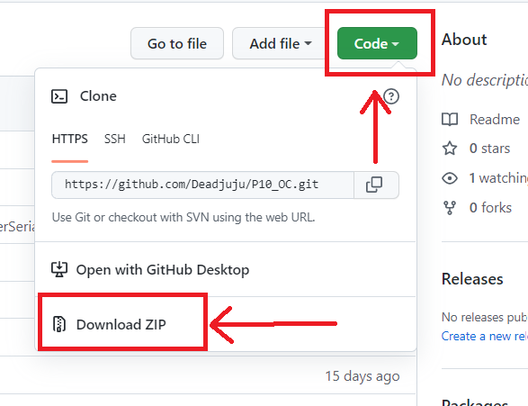

  
  
# PROJET 10 - Créez une API sécurisée RESTful en utilisant Django REST
  
  
***
***    
  
## Sommaire

* [I. Présentation du projet](#chapter1)
    * [L'application](#section1_1)
    * [Vocabulaire de l'application](#section1_2)
* [II. Installation du projet](#chapter2)
    * [Langage utilisé](#section2_1)
    * [Récupération du programme](#section2_2)
    * [Environnement virtuel](#section2_3)
    * [Installer les paquets](#section2_4)
* [III. Lancer le serveur local](#chapter3)
* [IV. Documentation de l'API](#chapter4)
* [V. Rapport Flake8](#chapter5)

***
***

## I. Présentation du projet 

### L'application 

Ce projet présente le code de la partie back-end d'un logiciel de *gestion des services d'assistance* ou encore *issue tracking system* développé pour l'entreprise "***fictive***" **SoftDesk**.  
L'application est une **API** qui peut-être compatible à la fois avec les applications **Web**, **IOS** ou **Android**.  

### Vocabulaire de l'application 

- **User** - représente les utilisateurs de l'application.
- **Project** - désigne un projet avec ses caractéristiques.
- **Contributor** - comprend tous les utilisateurs participant à un projet.
- **Issue** - représente un *problème* relatif à un projet.
- **Comment** - désigne un commentaire relatif à un problème (*issue*).  

***  

## II. Installation du projet 

### Langage utilisé **Python**. 
Ce programme a été écrit sur les version **Python 3.10.1**, **Django 4.0.4** et **DjangoREST 3.13.1**. 

### Récupération du programme 

Ouvrez un terminal dans le dossier de destination et entrez la commande suivante pour télécharger le repository:   
 
    git clone https://github.com/Deadjuju/P10_OC.git

Il est également possible de télécharger le fichier zip contenant l'intégralité du code du programme: 

  
   
Rendez-vous ensuite avec le terminal au niveau de la racine du projet en exécutant la commande suivante:

    cd P10_OC
### Environnement virtuel 
  
Dans la racine du dossier:  
     
  1. Taper la commande suivante pour générer l'environnement virtuel:  

    python -m venv env  

> *env* est le nom par défaut de l'environnement virtuel mais peut être nommé différemment.  
  
  2. Activer ensuite l'environnement virtuel :
    
    > Sur Windows  
    - terminal de type bash : source env/Scripts/activate
    - terminal de type shell : env\Scripts\activate
      
    > Sur Mac ou Linux
    - source env/bin/activate

### Installer les paquets 
  3. Pour installer les librairies supplémentaires exécuter la commande suivante :
  > *Vérifier bien que l'environnement virtuel soit activé*

    pip install -r requirements.txt

L'API est maintenant prête à être utilisée.  

***  

## III. Lancer le serveur en local 

Depuis le dossier racine du projet rendez vous avec le terminal dans le dossier racine avec l'environnement virtuel activé.

>Avant la première utilisation pensez à effectuer les **migrations** de la **base de données** avec la commande suivante :  

    python manage.py migrate

Et exécutez la commande suivante afin de démarrer le serveur en local

    python manage.py runserver  

L'url de base de l'API, notée ***{{base_url}}***, est 
**'htpp://127.0.0.1:8000/api'** ou plus globalement **'http://127.0.0.1:<numéro-du-port>/api'**

> Vous pouvez choisir le port en entrant la commande  
python manage.py runserver <numéro-du-port>  
http://127.0.0.1:<numéro-du-port>  
ex:  
python manage.py runserver 8080  
http://127.0.0.1:8080  
  
Enfin, pour arrêter le serveur utilisez les touches *ctrl* + *c* dans le terminal. 

***  

## IV. Documentation de l'API 

Une documentation détaillée de l'API est disponible à l'adresse suivante :  
><a href="https://documenter.getpostman.com/view/18466277/UzBgu9oR" target="_blank">https://documenter.getpostman.com/view/18466277/UzBgu9oR</a>

Vous trouverez dans cette documentation tout les points de terminaisons de l'API détaillés et documentés ainsi que des informations essentielles supplémentaires.

***

## V. Rapport Flake8   

**Flake8** permet d'éplucher le code écrit et de repérer les erreurs de syntaxes et les non conformités avec la PEP.
Un rapport html contenant les éventuelles erreurs peut-être généré.

Il se trouve à la racine du dossier dans le dossier : **flake8_rapport**

> - flake8_rapport
>   - index.html

Un nouveau rapport peut-être généré en exécutant la commande suivante dans le terminal :

    flake8 --format=html --htmldir=flake8_rapport

***  